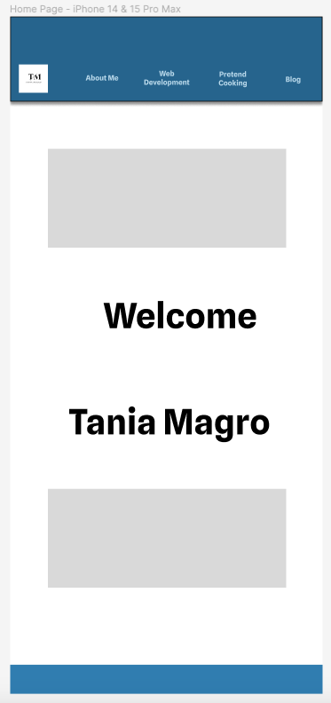

# {Tania Magro}_T1A2

## Links
Weblink to site: https://taniamagro.netlify.app/ 

GitHub Repo: https://github.com/TaniaDeveloper/Feb24-TaniaMagroPortfolio 

Presentation: https://youtu.be/Y4DpmHu9OlM 

Description of my portfolio website:

## Purpose:

The purpose of creating the portfolio, is to present ourselves to potential developers and IT professionals. 

By creating this portfolio we are showcasing our skills and understanding of HTML and CSS, along with who we are (our interests, professional knowledge) and showcasing our work (including upcoming projects).

## Target Audience:

My target audience is my current organisation (or portential new employer). The concept of creating this portfolio is to show the skills I have learnt over the next 10 months of completing this course, with the aim of moving towards a new position within the organisation, for a Systems Trainer. 

The hope is that I can be involved within the projects of any new systems/websites/technology that is being brought into the organisation, that In will be involved in the project and provide feedback, testing, systems writer (writing the training programmes and guides). 

## Functinality/Features

My target audience would be for potential employers to see my work, and my skills to accomplish the portfolio.

- Create a responsive website to be accessed for both iphone and desktop
- The design was about simplicity and acessibility for all. When selecting typography or colours ensuring they showed who I am but also, making sure that it was also readable.

- ### Navigation Bar
    Easily access all pages connected to the Navigation bar

* **Home:** Home page and introducing who I am
* **About Me:** What my professional background is. Listing my work experince and showcasing the knowledge I have of using various systems.
* **Web Development:** Blog posts (regarding the different coding and programming skills, that I am learning while completing the course) or links to future projects that I will be undertaking.
* **Blog:** A place where I can show my authentic self and write about topics or interests, as and when they are happening. From the a DIML to my diagnoses with MS, or event just a place to talk about the F1.
* **Contact:** How to connect with me

- ### Footer

    All pages created with the same footer, and accessible links to connect with me

## Screenshots

### Screenshots of my wireframe for Iphone

### Screenshots of my wireframe for Desktop

### Screenshots of my current website design for Desktop

I created the sitemap and wireframe in Figma (a new system that I am not used before). The Wireframes originally designed for Iphone and Desktop include another page, Pretend Cooking, with the contacts details being availble in the Footer.

However as I started building my site for the first time, I came across many issues and errors along the way. Inclkuding my last error my image in the front page moving before I deployedb for the last time. I checked the coding in Style.css and could not findn the error (I also copy and pasted from an archoved copy I had, hoping to fix the issue).

I have enjoyed bulding the site, and proud of what I have accomplished (first time building a site) however are very much aware of the time that is required to create these pages. Having been building the pages for the past 2 weeks.

Over the next few months, with further time and understanding, I home to update the portfolio to the look and feel that I created in my wireframes.

## Tech Stack
* Figma
* Github
* HTML
* CSS
* You Tube
* VSCode
* Terminal
* Canva
* Coolors

I have also used the following website for tips and tricks
* You Tube
* w3 Schools (also not also the best, as I have found that most nos there tipcs for HTML and CSS was purely HTML. You could not seperate the code into the various sections)
* Substack
* TikTok (some really great bite sized reels of videos to watch, and also lots of screenshots of websites to use to develop skills)

